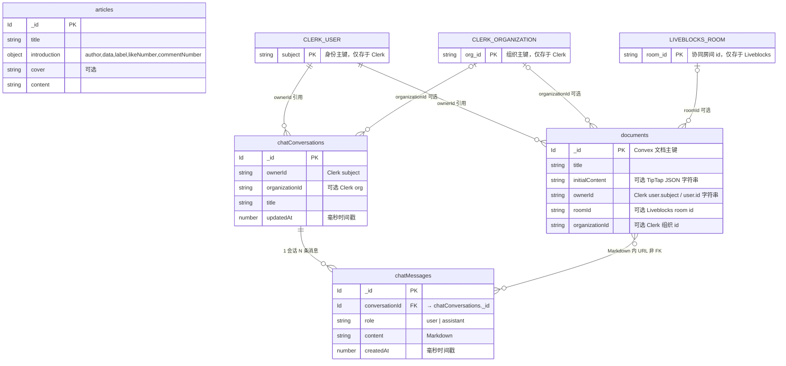

# SmartCampus / nextjs-docs 数据设计说明

本文描述当前仓库 **Convex 数据库表**、与 **Clerk / Liveblocks** 的边界，以及智能助手 **历史会话** 相关设计。部署后请执行 `npx convex dev` 或 `npx convex deploy` 使 schema 与函数同步到云端。

---

## 1. 总览

| 存储 | 用途 |
|------|------|
| **Convex** | 业务主库：文档元数据、文章、聊天会话与消息 |
| **Clerk** | 用户身份、组织（`organization_id` 等出现在 JWT / sessionClaims） |
| **Liveblocks** | 协同编辑实时文档（正文在 room，Convex 存 `initialContent` 与标题等） |
| **环境变量** | `DEEPSEEK_*`、`TAVILY_*` 等仅服务端，不入库 |

---

## 2. Convex 表：`documents`

**用途**：协同文档条目（与 Liveblocks room 关联；列表与权限在 Convex 侧）。

| 字段 | 类型 | 说明 |
|------|------|------|
| `title` | `string` | 文档标题 |
| `initialContent` | `optional string` | TipTap JSON 字符串或初始内容；在线编辑以 Liveblocks 为准 |
| `ownerId` | `string` | Clerk `user.id` |
| `roomId` | `optional string` | Liveblocks room（若使用） |
| `organizationId` | `optional string` | 组织文档时与 Clerk org 对齐 |

**索引**

- `by_owner_id`：`["ownerId"]`
- `by_organization_id`：`["organizationId"]`
- `search_title`：全文搜索标题，`filterFields`: `ownerId`, `organizationId`

**相关函数（节选）**：`getDocumentById`、`getDocuments`、`createDocument`、`updateDocumentById`、`removeDocumentById`、`createAssistantWriteupDocument`（助手新建学习纪要文档）等。

---

## 3. Convex 表：`articles`

**用途**：站内文章（与已移除的「文章首页」解耦后，表仍保留供文章详情等使用）。

| 字段 | 类型 | 说明 |
|------|------|------|
| `title` | `string` | 标题 |
| `introduction` | `object` | 作者、日期、标签、点赞数、评论数等 |
| `cover` | `optional string` | 封面 |
| `content` | `string` | 正文 |

---

## 4. Convex 表：`chatConversations`（智能助手历史）

**用途**：一条会话对应多次用户/助手消息；列表按 `updatedAt` 排序。

| 字段 | 类型 | 说明 |
|------|------|------|
| `ownerId` | `string` | Clerk `user.subject` |
| `organizationId` | `optional string` | 与当前 Clerk 组织一致时写入，便于后续扩展组织级会话 |
| `title` | `string` | 会话标题（首条用户消息截断或默认「新对话」） |
| `updatedAt` | `number` | 毫秒时间戳，每次追加消息时刷新 |

**索引**

- `by_owner_updated`：`["ownerId", "updatedAt"]` — 列表 `order("desc")` 取最近会话。

**API（`convex/chat.ts`）**

- `createChatConversation` — 新建会话  
- `listChatConversations` — 当前用户最近会话列表  
- `renameChatConversation` — 重命名（预留）  
- `deleteChatConversation` — 删除会话及其全部消息  

---

## 5. Convex 表：`chatMessages`

**用途**：会话内消息持久化；与前端 `useXChat` 同步（加载历史时 `setMessages`）。

| 字段 | 类型 | 说明 |
|------|------|------|
| `conversationId` | `Id<"chatConversations">` | 外键 |
| `role` | `"user" \| "assistant"` | 角色 |
| `content` | `string` | Markdown 正文 |
| `createdAt` | `number` | 毫秒时间戳，排序用 |

**索引**

- `by_conversation_created`：`["conversationId", "createdAt"]` — 按时间正序拉取一页消息。

**API**

- `appendChatMessage` — 写入一条并 `patch` 会话 `updatedAt`  
- `listChatMessages` — 按会话拉取（上限 500 条）  

**权限**：所有读写均校验会话归属（`ownerId` 或与 `organizationId` 匹配的组织成员，与 `documents` 思路一致）。

---

## 6. 前端与数据流（聊天历史）

1. 用户发送消息：`useXChat` 先插入本地气泡，再在 `useXAgent.request` 内：若无当前 `conversationId` 则 `createChatConversation`，再 `appendChatMessage(user)`，再请求 `/api/chat/stream`。  
2. 流结束后：`appendChatMessage(assistant)`。  
3. `agent.isRequesting()` 为 `false` 后，`useQuery(listChatMessages)` 结果通过 `useEffect` 写入 `setMessages`，与 Convex 对齐（含 `_id` 作为气泡 key）。  
4. 侧边栏：`listChatConversations` + `Conversations`；支持删除会话、新对话。

---

## 7. 关系示意（简化）

```
User (Clerk)
  └── chatConversations (ownerId)
        └── chatMessages (conversationId, role, content)

User (Clerk)
  └── documents (ownerId / organizationId)
        └── （正文协同在 Liveblocks）
```

---

## 8. 后续可扩展（未实现）

- 会话维度 `model` / `route` 元数据（math / general / doc_link）审计字段。  
- 消息分页游标、`token` 用量记录。  
- 组织内「共享会话」与索引调整（当前列表以 `ownerId` 为主）。

---

## 9. 全局 E-R 图（严格对应当前仓库）

下图：**矩形为 Convex 表**；**圆角/虚线框为 Convex 外系统**（无本库外键，仅字符串引用）。基数按实际约束表述。



**`articles` 表**：无外键、不连其他实体，图中省略连线（独立内容表）。

### 9.1 对话里能否含文档链接？图上为何与 `documents` 不相连？

- **产品/接口上**：可以。用户在智能体对话里粘贴 `…/smartcampus/documents/<id>` 等链接；服务端用正则解析后拉取文档（见 `extract-document-ids` 与 `doc_link` 流水线）。  
- **数据库上**：当前 **`chatMessages` 没有 `documentId` 字段**，只有 `content`（Markdown 字符串）。文档 id **若出现**，是嵌在正文里的 **子串**，不是 Convex 的 `v.id("documents")` 外键，因此严格按 **物理 schema** 画的 E-R 图里，**不应画成与 `documents` 的实线 FK 连线**（否则会误导成「库里有约束的引用」）。  
- **历史对话**：持久化的是整条消息的 `content`。用户曾经贴过的链接 **会随原文一起保存**；重新打开会话即可看到，**不需要**为「能再次点开」单独再建一条「链接」记录——除非你要做下面这类能力。

**若你希望「也要链接」在数据层显式化**（例如：按文档反查「哪些会话引用了我」、统计引用次数、或 UI 侧展示结构化「本消息关联的文档」），需要在 schema 中增加规范化设计，例如：

- `chatMessageDocumentRefs`：`messageId` + `documentId`（+ 可选 `mentionType`），在 `appendChatMessage` 时由服务端解析 `content` 后写入；或  
- 在 `chatMessages` 上增加 `linkedDocumentIds: v.array(v.id("documents"))`（需与正文解析保持一致）。

当前仓库 **未实现** 上述表/字段，故 E-R 以实存为准；上图中用 **`}o..o{` 虚线语义** 表示「仅正文子串层面的逻辑多对多」，**非数据库外键**。

**读图说明**

1. **`chatMessages` → `chatConversations`**：唯一在 Convex schema 中通过 `v.id("chatConversations")` 表达的 **表级引用**（一对多，删除会话时应用层级联删消息）。  
2. **`documents` / `chatConversations` → Clerk 用户与组织**：`ownerId`、`organizationId` 为 **字符串**，与 Clerk JWT 一致；Convex **不存用户表/组织表**。  
3. **`documents` → LIVEBLOCKS_ROOM**：`roomId` 为 **可选字符串**；正文协同在 Liveblocks，**不在 Convex 行内建模为子表**。  
4. **`articles`**：当前 `schema.ts` **未定义** 指向 `documents` / `users` 的外键；E-R 上为 **孤立强实体**（仅自身属性与 `_id`）。  
5. **`chatMessages` 与 `documents`**：见 **§9.1**；图中 `}o--o{` 表示 **Markdown 内嵌链接** 的逻辑多对多，**不是** Convex 外键。  
6. **索引**：未在 E-R 中展开；见上文各表「索引」小节（`by_owner_id`、`by_organization_id`、`search_title`、`by_owner_updated`、`by_conversation_created`）。
